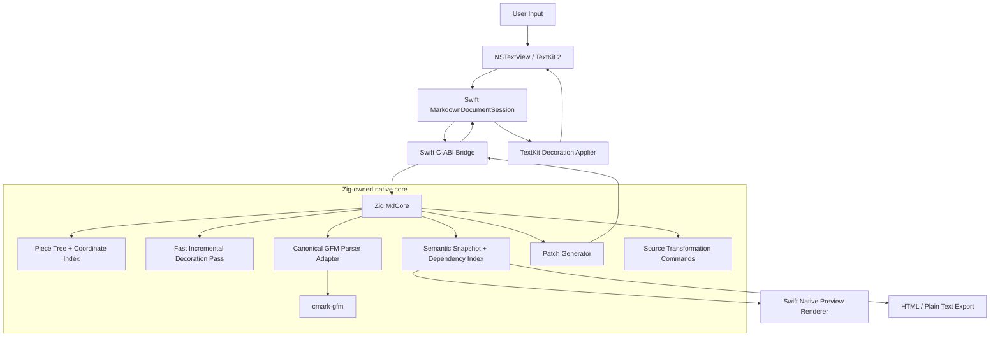
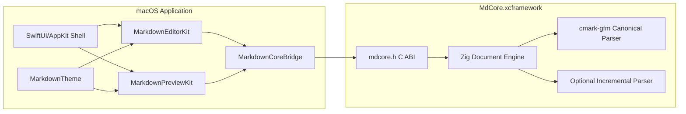

# Executive summary

The system is split into two independently testable products:

1. **`MdCore`**, a Zig static library with a narrow C ABI. It owns the UTF-8 source buffer, edit transactions, coordinate mapping, canonical GFM parsing, semantic snapshots, source-range recovery, transformation commands, and incremental patch generation.
2. **`MarkdownUI`**, a Swift package for macOS. It owns `NSTextView`, TextKit 2 integration, selection and input behavior, native styling, viewport-aware patch application, accessibility, undo registration, task-list interactions, image loading, and optional preview composition.

The formal GitHub Flavored Markdown specification is a strict superset of CommonMark and adds five named extensions: tables, task-list items, strikethrough, extended autolinks, and disallowed raw HTML filtering.[^1] The canonical parser is therefore **GitHub's `cmark-gfm`**, compiled into the Zig library and configured with all five GFM extensions.[^2]

:::finding{title="Primary Architecture Decision"}
`cmark-gfm` is the correctness authority. Incremental scanners and optional Tree-sitter parsing may accelerate editor feedback, but they never define final semantics. Every committed semantic snapshot must agree with the canonical GFM parse.
:::

The editor never converts Markdown into a second editable rich-text document. The canonical content remains the exact Markdown source. Native styling is applied as presentation metadata over that source.

:::metrics
- Canonical format: UTF-8 Markdown source
- Public binary boundary: C ABI
- Correctness authority: cmark-gfm
- Editor framework: AppKit + TextKit 2
- Minimum macOS target: macOS 13
- Primary CPU targets: arm64, x86_64
- Typing budget: < 8 ms main-thread work
- Canonical patch target: < 30 ms for 1 MiB documents
:::

# 1. Scope

## 1.1 Goals

The implementation must:

- parse the complete formal GFM specification;
- preserve the original source bytes except when the user explicitly edits them;
- provide exact or conservative source ranges for every semantic construct;
- support responsive editing with large documents;
- expose a small, versioned, ownership-safe C API;
- integrate with Swift without exposing Zig or `cmark-gfm` implementation details;
- render Markdown source natively in an `NSTextView` using TextKit 2;
- support a native read-only preview for standard GFM blocks;
- treat raw HTML and external content as untrusted;
- provide conformance, fuzz, performance, ABI, and UI tests;
- package cleanly as an `XCFramework` and Swift Package.

## 1.2 Definition of “full GFM”

For this architecture, **full GFM** means:

- all CommonMark block and inline constructs;
- GFM tables;
- GFM task-list items;
- GFM strikethrough;
- GFM extended autolinks;
- GFM tag filtering for disallowed raw HTML;
- behavior validated against the official GFM specification examples.

It does **not** automatically include GitHub product features that are outside the formal GFM specification, such as:

- issue and pull-request references;
- user and team mentions;
- emoji shortcodes;
- repository-relative link rewriting;
- syntax highlighting policy;
- Mermaid rendering;
- mathematical notation;
- YAML frontmatter;
- footnotes;
- custom directives.

Those features belong in an explicit extension layer.

:::callout{type="warn" title="Specification Boundary"}
GitHub.com performs additional post-processing and sanitization after GFM is converted to HTML. Matching the formal GFM specification does not, by itself, reproduce every behavior of GitHub's website.[^1]
:::

## 1.3 Non-goals

The first production release will not:

- replace AppKit text input, shaping, accessibility, or layout;
- use a WebView as the editable surface;
- make hidden Markdown markers consume zero width;
- execute arbitrary HTML, JavaScript, or remote embedded content;
- promise collaborative editing or CRDT semantics;
- expose the parser's internal tree directly over the FFI boundary;
- require Tree-sitter for correctness;
- implement every optional editor extension in the GFM core.

# 2. Architectural principles

## 2.1 One canonical source

The exact UTF-8 Markdown source is the document of record.

```text
Source bytes
  ├── parsed into semantic structures
  ├── decorated in the editor
  ├── rendered into previews
  └── saved without normalization
```

The system never edits a generated rich-text representation and then attempts to serialize it back into Markdown.

## 2.2 Correctness before incrementality

A full-document native parse is acceptable as the first correctness path because `cmark-gfm` is implemented in C, is designed as a portable parsing library, and exposes an AST and renderers.[^2] Incremental optimization is introduced behind a stable parser interface.

## 2.3 Coarse language boundary

Swift calls the core once per edit transaction and receives contiguous immutable arrays. Swift does not walk parser nodes through repeated FFI calls.

## 2.4 Presentation is platform-owned

The core identifies meaning. Swift decides fonts, colors, visibility, attachments, animations, cursor behavior, and accessibility descriptions.

## 2.5 Revisioned asynchronous work

Every document mutation increments a revision. Any parse or render result that does not match the current revision is discarded.

## 2.6 Extensions are isolated

GFM parsing remains deterministic and spec-conformant. Frontmatter, directives, footnotes, math, Mermaid, and application-specific link rewriting are implemented as separately enabled extension modules.

# 3. System context



The architecture has three boundaries:

| Boundary | Contract | Stability expectation |
| --- | --- | --- |
| Swift UI ↔ Swift session | Swift protocols and value types | Can evolve with semantic versioning |
| Swift bridge ↔ Zig core | Versioned C ABI | Stable across minor releases |
| Zig parser adapter ↔ parser backend | Internal Zig interface | Freely replaceable |

# 4. Repository layout

```text
markdown-engine/
├── core/
│   ├── build.zig
│   ├── build.zig.zon
│   ├── include/
│   │   └── mdcore.h
│   ├── src/
│   │   ├── api.zig
│   │   ├── document.zig
│   │   ├── piece_tree.zig
│   │   ├── coordinate_index.zig
│   │   ├── edit.zig
│   │   ├── snapshot.zig
│   │   ├── semantic_node.zig
│   │   ├── span.zig
│   │   ├── dependency_index.zig
│   │   ├── source_locator.zig
│   │   ├── patch.zig
│   │   ├── commands.zig
│   │   ├── parser/
│   │   │   ├── interface.zig
│   │   │   ├── canonical_cmark.zig
│   │   │   ├── fast_pass.zig
│   │   │   └── incremental_gfm.zig
│   │   ├── render/
│   │   │   ├── html.zig
│   │   │   ├── plaintext.zig
│   │   │   └── event_stream.zig
│   │   └── extensions/
│   │       ├── frontmatter.zig
│   │       ├── directives.zig
│   │       ├── footnotes.zig
│   │       └── registry.zig
│   ├── vendor/
│   │   └── cmark-gfm/
│   └── tests/
│       ├── conformance/
│       ├── unit/
│       ├── fuzz/
│       └── benchmarks/
├── apple/
│   ├── Package.swift
│   ├── Sources/
│   │   ├── MarkdownCoreBridge/
│   │   ├── MarkdownEditorKit/
│   │   ├── MarkdownPreviewKit/
│   │   └── MarkdownTheme/
│   ├── Tests/
│   │   ├── MarkdownCoreBridgeTests/
│   │   ├── MarkdownEditorKitTests/
│   │   └── MarkdownPreviewKitTests/
│   └── DemoApp/
├── scripts/
│   ├── build-xcframework.sh
│   ├── run-conformance.sh
│   └── verify-abi.sh
└── docs/
    ├── architecture.md
    ├── c-api.md
    └── extension-authoring.md
```

# 5. Zig core architecture

## 5.1 Core responsibility boundary

The Zig core owns:

- document bytes;
- revision numbers;
- edit validation;
- efficient storage;
- UTF-8, UTF-16, and line/column conversion;
- canonical GFM parsing;
- optional incremental analysis;
- semantic node normalization;
- stable node identity;
- source marker ranges;
- dependency invalidation;
- semantic patch generation;
- Markdown-aware edit commands;
- HTML and plain-text export;
- extension registration;
- deterministic diagnostics.

The Zig core does not own:

- fonts or colors;
- `NSRange` or `String.Index` values;
- AppKit objects;
- selection drawing;
- drag and drop;
- accessibility objects;
- image decoding;
- network access;
- window or document-controller state.

## 5.2 Document object

```zig
const Document = struct {
    allocator: std.mem.Allocator,
    revision: u64,

    text: PieceTree,
    coordinates: CoordinateIndex,

    parser: ParserCoordinator,
    canonical_snapshot: ?SemanticSnapshot,
    fast_snapshot: ?DecorationSnapshot,

    dependencies: DependencyIndex,
    node_ids: StableIdAllocator,

    options: DocumentOptions,
};
```

Every public document handle refers to exactly one `Document`. A document is mutated only on its assigned serial executor.

## 5.3 Piece tree

Use a balanced piece tree with two backing buffers:

- **original buffer**: immutable bytes loaded from disk;
- **add buffer**: append-only bytes from insertions.

Each leaf references a slice of one backing buffer. Each internal node stores aggregate metrics:

```zig
const Aggregate = struct {
    utf8_bytes: u64,
    utf16_units: u64,
    newline_count: u64,
    scalar_count: u64,
};
```

This supports:

- insertion and deletion in $O(log n)$ tree work plus inserted-byte cost;
- byte offset ↔ UTF-16 offset conversion;
- byte offset ↔ line and column conversion;
- line lookup;
- parser streaming callbacks;
- cheap immutable snapshots through structural sharing or frozen piece lists.

:::callout{type="note" title="Initial Simplification"}
A contiguous UTF-8 buffer can ship in an early prototype, provided the `DocumentBuffer` interface is preserved. The piece tree should become mandatory before claiming large-document performance targets.
:::

## 5.4 Coordinate spaces

The system explicitly models four coordinate spaces:

| Space | Owner | Unit | Primary use |
| --- | --- | --- | --- |
| Source byte | Zig core | UTF-8 byte | Parsing, storage, C ABI |
| Source point | Zig core | line + UTF-8 byte column | Parser integration |
| Cocoa text | Swift | UTF-16 code unit | `NSRange`, TextKit |
| Visual layout | TextKit 2 | glyph/layout fragment | Caret, selection, drawing |

All C ABI ranges use UTF-8 byte offsets. Conversion to UTF-16 occurs only in the Swift bridge or through explicit conversion calls.

```zig
pub const ByteRange = extern struct {
    start: u64,
    end: u64,
};

pub const TextPoint = extern struct {
    row: u32,
    byte_column: u32,
};
```

No API field named only `offset` is permitted; the unit must be obvious from the type or field name.

## 5.5 Edit transaction

```zig
pub const Edit = struct {
    start_byte: u64,
    old_end_byte: u64,
    inserted_utf8: []const u8,
};
```

An edit is accepted only when:

- `start_byte <= old_end_byte`;
- the removed range is inside the current document;
- both boundaries are valid UTF-8 scalar boundaries;
- inserted bytes are valid UTF-8, or the document's replacement policy explicitly permits repair;
- the caller's expected revision matches the document revision.

The core returns the resulting revision and enough coordinate information for the caller to reconcile its state.

## 5.6 Parser coordinator

```zig
const ParserCoordinator = struct {
    canonical: CanonicalGfmParser,
    fast_pass: FastDecorationParser,
    incremental: ?IncrementalGfmParser,
};
```

The coordinator separates three concerns:

### Canonical parser

- uses `cmark-gfm`;
- enables the five formal GFM extensions;
- parses an immutable source snapshot;
- produces the authoritative semantic tree;
- produces canonical HTML and plain text;
- runs for every settled revision, subject to debounce and cancellation policy.

### Fast decoration pass

- implemented in Zig;
- scans only the edited repair region;
- recognizes high-confidence local constructs;
- returns provisional style spans immediately;
- never changes document meaning;
- is allowed to omit uncertain constructs;
- is replaced by the canonical patch when available.

### Optional incremental GFM parser

- implemented later in Zig or through a maintained parser backend;
- must pass the same conformance suite as the canonical parser;
- may become the primary semantic parser only after differential testing reaches zero known divergences;
- still retains `cmark-gfm` as a test oracle and export fallback.

Tree-sitter is suitable for efficient reparsing after edits and supports editing an existing syntax tree before parsing with it again.[^3] It may be used for block structure, code-fence injections, or provisional syntax analysis. It is not the conformance authority in this design.

## 5.7 Canonical `cmark-gfm` adapter

The adapter performs the following initialization once per process:

```c
cmark_gfm_core_extensions_ensure_registered();
```

For each parser instance, it attaches:

```text
table
strikethrough
autolink
tagfilter
tasklist
```

The adapter:

1. reads a stable UTF-8 snapshot from the piece tree;
2. creates a `cmark_parser`;
3. attaches all required syntax extensions;
4. feeds the source;
5. finishes the AST;
6. traverses the AST once;
7. converts parser-specific nodes into engine-owned semantic nodes;
8. recovers exact source and marker ranges;
9. builds dependency indexes;
10. destroys the parser AST after normalization.

The engine never returns raw `cmark_node *` pointers to callers.

## 5.8 Semantic model

The normalized semantic tree is backend-independent.

```zig
pub const NodeKind = enum(u16) {
    document,
    block_quote,
    list,
    list_item,
    task_list_item,
    paragraph,
    heading,
    thematic_break,
    code_block,
    html_block,
    table,
    table_head,
    table_body,
    table_row,
    table_cell,
    text,
    soft_break,
    hard_break,
    code_span,
    emphasis,
    strong,
    strikethrough,
    link,
    image,
    autolink,
    html_inline,
    custom_block,
    custom_inline,
};
```

```zig
pub const SemanticNode = extern struct {
    id: u64,
    parent_index: u32,
    first_child_index: u32,
    child_count: u32,

    kind: u16,
    flags: u16,

    source_start_byte: u64,
    source_end_byte: u64,
    content_start_byte: u64,
    content_end_byte: u64,

    metadata_index: u32,
    reserved: u32,
};
```

The normalized snapshot stores nodes in preorder in one contiguous array. Child relationships are represented by indices rather than pointers.

## 5.9 Decoration spans

Semantic nodes describe structure. Decoration spans describe how source ranges may be presented.

```zig
pub const SpanRole = enum(u16) {
    body,
    heading_1,
    heading_2,
    heading_3,
    heading_4,
    heading_5,
    heading_6,
    emphasis,
    strong,
    strikethrough,
    code,
    code_fence,
    code_language,
    link_label,
    link_destination,
    image_label,
    image_destination,
    block_quote_marker,
    list_marker,
    task_marker,
    table_delimiter,
    html,
    syntax_marker,
};

pub const DecorationSpan = extern struct {
    node_id: u64,
    start_byte: u64,
    end_byte: u64,
    role: u16,
    behavior: u16,
    metadata_index: u32,
};
```

`behavior` is a bitset such as:

```text
DIM_WHEN_INACTIVE
REVEAL_AT_CARET
INTERACTIVE
MONOSPACED
NO_SPELLCHECK
PRESERVE_FOREGROUND
```

The Swift layer maps roles to visual attributes.

## 5.10 Source locator

Parser AST positions alone are not sufficient for rich source editing. The `SourceLocator` performs a deterministic second pass over the original bytes to locate:

- opening and closing emphasis delimiters;
- strong and strikethrough delimiters;
- link label, destination, title, and brackets;
- image marker and label ranges;
- code-span fences and normalized code content;
- heading markers and optional closing markers;
- list markers and indentation;
- task-list checkbox markers;
- table delimiter rows and cell separators;
- fenced-code opening fence, info string, content, and closing fence;
- raw HTML source ranges.

For ambiguous constructs, the locator is conservative: it returns the enclosing source range and sets `MD_NODE_RANGE_APPROXIMATE` rather than inventing an exact marker location.

:::finding{title="Range Correctness Rule"}
A semantic node may exist without exact marker subranges. A wrong range is never preferable to a conservative range marked approximate.
:::

## 5.11 Stable node identity

Stable IDs reduce unnecessary UI updates.

A node identity candidate is computed from:

- node kind;
- normalized parent path;
- source anchor near the opening boundary;
- selected metadata, such as heading level or link destination;
- a local content hash.

After an edit, the diff engine matches old and new nodes within repair windows. IDs are preserved only when the match is unambiguous.

IDs are document-local and valid only for the lifetime of the document handle.

## 5.12 Dependency index

Some Markdown semantics are nonlocal. The dependency index tracks:

- normalized link-reference labels → definition nodes;
- reference-link nodes → labels;
- code-fence nodes → language identifiers;
- image nodes → normalized destinations;
- heading nodes → generated outline entries;
- optional extension references.

Editing a link-reference definition invalidates all dependent links even when they occur outside the parser's immediate changed region.

## 5.13 Semantic patches

A patch contains replacement regions rather than a full tree whenever possible.

```zig
pub const Patch = struct {
    base_revision: u64,
    result_revision: u64,
    invalidated_byte_ranges: []ByteRange,
    removed_node_ids: []u64,
    upserted_nodes: []SemanticNode,
    decoration_spans: []DecorationSpan,
    metadata: []MetadataRecord,
    diagnostics: []Diagnostic,
};
```

A patch's memory is immutable until released by the caller.

# 6. C ABI

Zig explicitly supports exporting C-ABI-compatible libraries for consumption by other languages.[^4] The public header is hand-maintained and treated as the stable product contract.

## 6.1 Versioning

```c
#define MDCORE_ABI_VERSION_MAJOR 1
#define MDCORE_ABI_VERSION_MINOR 0
#define MDCORE_ABI_VERSION_PATCH 0

uint32_t mdcore_abi_version(void);
const char *mdcore_version_string(void);
```

Major ABI changes require a new exported symbol family or a major package version.

## 6.2 Opaque handles

```c
typedef struct MdDocument MdDocument;
typedef struct MdSnapshot MdSnapshot;
typedef struct MdPatch MdPatch;
typedef struct MdBuffer MdBuffer;
```

Swift never allocates these structures directly.

## 6.3 Status values

```c
typedef enum MdStatus {
    MD_STATUS_OK = 0,
    MD_STATUS_INVALID_ARGUMENT = 1,
    MD_STATUS_OUT_OF_MEMORY = 2,
    MD_STATUS_INVALID_UTF8 = 3,
    MD_STATUS_STALE_REVISION = 4,
    MD_STATUS_PARSE_FAILED = 5,
    MD_STATUS_UNSUPPORTED = 6,
    MD_STATUS_INTERNAL_ERROR = 255
} MdStatus;
```

No exception or Zig error union crosses the ABI.

## 6.4 Core API

```c
typedef struct MdBytes {
    const uint8_t *ptr;
    size_t len;
} MdBytes;

typedef struct MdByteRange {
    uint64_t start;
    uint64_t end;
} MdByteRange;

typedef struct MdEdit {
    uint64_t expected_revision;
    uint64_t start_byte;
    uint64_t old_end_byte;
    MdBytes replacement;
} MdEdit;

typedef struct MdDocumentOptions {
    uint32_t struct_size;
    uint32_t flags;
    uint64_t max_document_bytes;
    uint32_t extension_flags;
    uint32_t reserved;
} MdDocumentOptions;

MdStatus md_document_create(
    MdBytes initial_utf8,
    const MdDocumentOptions *options,
    MdDocument **out_document
);

void md_document_destroy(MdDocument *document);

uint64_t md_document_revision(const MdDocument *document);
uint64_t md_document_utf8_length(const MdDocument *document);
uint64_t md_document_utf16_length(const MdDocument *document);

MdStatus md_document_apply_edit(
    MdDocument *document,
    const MdEdit *edit,
    MdPatch **out_fast_patch
);

MdStatus md_document_build_canonical_patch(
    MdDocument *document,
    uint64_t revision,
    MdPatch **out_patch
);

void md_patch_release(MdPatch *patch);
```

## 6.5 Patch views

```c
typedef struct MdSpanView {
    const MdDecorationSpan *ptr;
    size_t len;
} MdSpanView;

typedef struct MdRangeView {
    const MdByteRange *ptr;
    size_t len;
} MdRangeView;

uint64_t md_patch_base_revision(const MdPatch *patch);
uint64_t md_patch_result_revision(const MdPatch *patch);
MdRangeView md_patch_invalidated_ranges(const MdPatch *patch);
MdSpanView md_patch_decoration_spans(const MdPatch *patch);
```

All returned views are valid only while the owning `MdPatch` exists.

## 6.6 Coordinate conversion API

```c
MdStatus md_document_byte_to_utf16(
    const MdDocument *document,
    uint64_t byte_offset,
    uint64_t *out_utf16_offset
);

MdStatus md_document_utf16_to_byte(
    const MdDocument *document,
    uint64_t utf16_offset,
    uint64_t *out_byte_offset
);

MdStatus md_document_byte_range_to_utf16(
    const MdDocument *document,
    MdByteRange byte_range,
    MdUtf16Range *out_range
);
```

Batch conversion variants should also be provided so Swift can translate hundreds of spans in one call.

## 6.7 Rendering API

```c
typedef enum MdRenderFormat {
    MD_RENDER_HTML = 1,
    MD_RENDER_PLAINTEXT = 2,
    MD_RENDER_EVENT_STREAM = 3
} MdRenderFormat;

typedef struct MdRenderOptions {
    uint32_t struct_size;
    uint32_t flags;
    MdRenderFormat format;
} MdRenderOptions;

MdStatus md_document_render(
    MdDocument *document,
    uint64_t revision,
    const MdRenderOptions *options,
    MdBuffer **out_buffer
);

MdBytes md_buffer_bytes(const MdBuffer *buffer);
void md_buffer_release(MdBuffer *buffer);
```

## 6.8 Command API

Formatting commands return source edits rather than mutating UI attributes.

```c
typedef enum MdCommandKind {
    MD_COMMAND_TOGGLE_EMPHASIS,
    MD_COMMAND_TOGGLE_STRONG,
    MD_COMMAND_TOGGLE_STRIKETHROUGH,
    MD_COMMAND_INLINE_CODE,
    MD_COMMAND_INSERT_LINK,
    MD_COMMAND_SET_HEADING,
    MD_COMMAND_TOGGLE_BLOCK_QUOTE,
    MD_COMMAND_TOGGLE_TASK_ITEM,
    MD_COMMAND_INDENT_LIST_ITEM,
    MD_COMMAND_OUTDENT_LIST_ITEM
} MdCommandKind;

MdStatus md_document_plan_command(
    MdDocument *document,
    uint64_t revision,
    MdCommandKind command,
    MdByteRange selection,
    const MdCommandOptions *options,
    MdEditList **out_edits
);
```

The Swift layer applies the returned edits through its normal undoable editing path.

# 7. Swift and AppKit architecture

## 7.1 Package modules

### `MarkdownCoreBridge`

- imports the C header;
- wraps opaque handles in Swift reference types;
- translates status codes into Swift errors;
- guarantees `deinit` cleanup;
- exposes `Sendable` immutable patch values where valid;
- batches coordinate conversions;
- contains no AppKit dependency.

### `MarkdownEditorKit`

- provides `MarkdownTextView`;
- owns the TextKit 2 stack;
- mirrors native edits into the core;
- applies decoration patches;
- coordinates undo and redo;
- manages active-block marker visibility;
- supports editor commands;
- maintains revision discipline.

### `MarkdownPreviewKit`

- consumes semantic snapshots or event streams;
- builds native block views;
- virtualizes large previews;
- handles images and links;
- optionally falls back to sanitized HTML for raw HTML blocks.

### `MarkdownTheme`

- maps semantic roles to fonts, colors, paragraph styles, and marker behaviors;
- contains light, dark, and high-contrast defaults;
- supports application-provided themes.

## 7.2 TextKit 2 stack

```text
MarkdownTextView
  └── NSTextContentStorage
      └── NSTextLayoutManager
          └── NSTextContainer
```

The editor uses TextKit 2 for:

- text input and IME behavior;
- cursor and selection;
- bidirectional text;
- accessibility;
- spell checking;
- layout fragments;
- viewport-oriented layout;
- native copy, paste, drag, and undo behavior.

Apple exposes the TextKit 2 components used here through `NSTextContentStorage`, `NSTextLayoutManager`, and `NSTextViewportLayoutController`.[^5]

## 7.3 Swift document session

```swift
@MainActor
public final class MarkdownDocumentSession {
    public let textView: MarkdownTextView

    private let core: MarkdownCoreDocument
    private let parseQueue: DispatchQueue
    private var revision: UInt64
    private var pendingCanonicalWork: DispatchWorkItem?
    private let patchApplier: DecorationPatchApplier
    private let rangeMapper: RangeMapper
}
```

The session is the only object allowed to coordinate mutations between TextKit and the core.

## 7.4 Edit capture

The editor intercepts mutations at the text-storage delegate or content-manager transaction boundary.

For each native edit:

1. capture the old UTF-16 range;
2. obtain replacement text;
3. convert the old UTF-16 range to a core byte range using the pre-edit coordinate index;
4. let TextKit commit the native mutation;
5. send the equivalent byte edit to the core;
6. receive and apply a fast patch;
7. schedule canonical parsing for the resulting revision;
8. register undo information using the native inverse edit.

The visible character insertion must not wait for canonical parsing.

## 7.5 Patch application

```swift
@MainActor
final class DecorationPatchApplier {
    func apply(
        _ patch: MarkdownPatch,
        to storage: NSTextContentStorage,
        theme: MarkdownTheme,
        activeRanges: [NSRange]
    ) {
        storage.performEditingTransaction {
            // 1. Remove engine-owned attributes in invalidated ranges.
            // 2. Add newly mapped semantic attributes.
            // 3. Preserve user and system attributes outside engine namespace.
            // 4. Invalidate only affected layout fragments.
        }
    }
}
```

All Markdown attributes use namespaced keys, for example:

```swift
extension NSAttributedString.Key {
    static let mdRole = Self("com.example.md.role")
    static let mdNodeID = Self("com.example.md.node-id")
    static let mdMarkerBehavior = Self("com.example.md.marker-behavior")
}
```

The patch applier must never remove unrelated spelling, grammar, selection, or application attributes.

## 7.6 Marker presentation

The implementation ships in three stages:

### Stage 1: dim markers

- syntax characters remain visible;
- markers use a low-contrast style;
- content receives semantic typography;
- lowest risk for selection, IME, and accessibility.

### Stage 2: contextual concealment

- markers outside the active block can become transparent or strongly de-emphasized;
- the active paragraph, list item, table row, or code fence reveals its markers;
- marker width remains unchanged.

### Stage 3: layout substitution

- a custom TextKit 2 presentation layer may render selected marker ranges with reduced width;
- source bytes remain untouched;
- selection and accessibility behavior must be separately validated.

:::callout{type="warn" title="Do Not Start With Zero-Width Markers"}
True zero-width concealment complicates caret movement, selection rectangles, text input composition, hit testing, VoiceOver, and bidirectional text. It is a later rendering enhancement, not a parser requirement.
:::

## 7.7 Active block calculation

The Swift session reports caret and selection byte ranges to the core. The core returns enclosing semantic block IDs. The renderer reveals markers for:

- blocks containing the insertion point;
- all blocks intersecting a nonempty selection;
- a small configurable context around the active block;
- malformed constructs currently being typed.

## 7.8 Interactive task-list items

A task-list marker such as `[ ]` or `[x]` remains source text.

The renderer may draw a native checkbox overlay or attachment aligned with the marker range. Clicking it invokes `MD_COMMAND_TOGGLE_TASK_ITEM`, which returns a source replacement edit.

No checkbox state is stored outside the Markdown source.

## 7.9 Links

The source editor distinguishes:

- label range;
- destination range;
- optional title range;
- autolink range;
- unresolved reference-link range.

Command-click opens a validated URL. A normal click continues to place the caret unless the application explicitly chooses link activation mode.

## 7.10 Code blocks

The Markdown core returns:

- fence ranges;
- info-string range;
- content range;
- normalized language identifier.

Syntax highlighting for the embedded language is a separate asynchronous decoration pipeline. Tree-sitter included ranges are suitable for parsing selected regions of mixed-language documents.[^3]

Code-highlighting patches use a separate attribute namespace and revision tied to the containing code-block node ID.

# 8. Native preview architecture

## 8.1 Preview contract

The preview consumes an immutable semantic snapshot or event stream. It never reparses source in Swift.

```swift
public protocol MarkdownPreviewNodeRenderer {
    associatedtype Body: NSView
    func makeView(for node: MarkdownNode, context: PreviewContext) -> Body
    func updateView(_ view: Body, for node: MarkdownNode, context: PreviewContext)
}
```

## 8.2 Block virtualization

Use `NSCollectionView` or a custom vertically stacked layout with reusable block views.

One preview item corresponds to a top-level or selected container block:

- paragraph;
- heading;
- block quote;
- list;
- code block;
- table;
- thematic break;
- HTML block.

Long documents render only blocks near the viewport.

## 8.3 Native block renderers

| GFM construct | Native preview component |
| --- | --- |
| Paragraph and heading | TextKit-backed rich text view |
| Emphasis, strong, strike | Attributed-string spans |
| Links and autolinks | Link attributes with validated actions |
| Images | Async `NSImageView` with placeholder and cache |
| Block quote | Container with inset rule and text view |
| Ordered/unordered list | Custom list block layout |
| Task list | `NSButton` checkbox + source-backed command |
| Code block | Scrollable monospaced text view |
| Table | Reusable grid or collection layout |
| Thematic break | Separator view |
| Raw HTML | Safe source presentation by default |

## 8.4 Raw HTML policy

Formal GFM recognizes raw HTML and applies a disallowed-tag filter, while GitHub's production environment performs additional sanitization.[^1]

The native preview therefore supports two policies:

### Safe native policy, default

- raw HTML is represented as escaped source or a styled placeholder;
- no scripts, styles, forms, embeds, or arbitrary network loads execute;
- HTML does not affect surrounding AppKit layout.

### Sandboxed HTML policy, optional

- canonical HTML is produced by the core in safe mode;
- additional application-level sanitization runs;
- fragments render in a nonpersistent `WKWebView` with scripts disabled;
- navigation is intercepted;
- remote content is blocked unless explicitly allowed.

The source editor always displays the actual raw HTML source.

## 8.5 Image loading

The core emits the source destination and resolved destination only when a resolver is configured. Swift owns loading.

The loader must support:

- file URLs permitted by sandbox scope;
- application-approved remote HTTPS URLs;
- cancellation when blocks leave the viewport;
- size and pixel-count limits;
- memory and disk caching;
- placeholder and failure states;
- accessibility descriptions from alt text.

# 9. GFM feature matrix

:::table{caption="Formal GFM coverage and ownership."}
| Feature | Canonical parse | Source decoration | Native preview | Interactive behavior |
| --- | --- | --- | --- | --- |
| Thematic breaks | cmark-gfm | Marker span | Separator | None |
| ATX headings | cmark-gfm | Level + marker spans | Heading text | Outline navigation |
| Setext headings | cmark-gfm | Content + underline | Heading text | Outline navigation |
| Indented code | cmark-gfm | Monospaced block | Code block | Copy |
| Fenced code | cmark-gfm | Fence/info/content | Code block | Language highlighting |
| HTML blocks | cmark-gfm | HTML role | Safe source/fallback | Policy-controlled |
| Link definitions | cmark-gfm | Definition spans | Not separately shown | Dependency resolution |
| Paragraphs | cmark-gfm | Body role | Rich text | Selection/link actions |
| Tables | cmark-gfm table extension | Delimiter/cell spans | Native grid | Cell selection optional |
| Block quotes | cmark-gfm | Quote markers | Inset quote | None |
| Lists | cmark-gfm | Marker/indent spans | Native list | Indent/outdent |
| Task-list items | cmark-gfm tasklist extension | Checkbox marker | Native checkbox | Toggle source marker |
| Code spans | cmark-gfm | Fence/content spans | Monospaced inline | Copy |
| Emphasis | cmark-gfm | Delimiter/content spans | Italic | Toggle command |
| Strong | cmark-gfm | Delimiter/content spans | Bold | Toggle command |
| Strikethrough | cmark-gfm extension | Delimiter/content spans | Strike | Toggle command |
| Links | cmark-gfm | Label/destination/title | Clickable link | Open/copy/edit |
| Images | cmark-gfm | Label/destination | Async image | Open/copy |
| CommonMark autolinks | cmark-gfm | Link span | Clickable link | Open/copy |
| GFM extended autolinks | cmark-gfm autolink extension | Link span | Clickable link | Open/copy |
| Raw HTML | cmark-gfm + tagfilter | HTML role | Safe policy | None by default |
| Hard/soft breaks | cmark-gfm | Break roles | Layout behavior | None |
:::

# 10. End-to-end edit pipeline

```mermaid caption="Single edit transaction and canonical reconciliation." width="94%"
sequenceDiagram
    participant U as User
    participant T as TextKit 2
    participant S as Swift Session
    participant Z as Zig Core
    participant C as cmark-gfm Worker

    U->>T: Insert or replace text
    T->>S: Native edit callback (UTF-16 range)
    S->>Z: Convert range + apply byte edit (revision N)
    Z->>Z: Update piece tree and coordinate index
    Z->>Z: Fast repair scan
    Z-->>S: Provisional patch (revision N+1)
    S->>T: Apply attributes in one transaction
    S->>C: Schedule canonical parse of snapshot N+1
    C->>C: Parse full GFM + normalize AST
    C->>Z: Canonical semantic snapshot
    Z->>Z: Diff against prior snapshot
    Z-->>S: Canonical patch (revision N+1)
    S->>S: Verify revision still current
    S->>T: Replace provisional decorations
```

## 10.1 Main-thread work

The main thread performs only:

- native text mutation;
- range conversion using cached indexes;
- one core edit call;
- application of a compact fast patch;
- scheduling of canonical work.

It does not perform:

- full-document parsing;
- HTML generation;
- full attributed-string rebuilding;
- image decoding;
- code-language parsing.

## 10.2 Canonical scheduling

Recommended policy:

- schedule immediately after every edit;
- coalesce successive pending tasks that have not begun;
- allow a running parse to finish against its immutable snapshot;
- discard stale results by revision;
- parse synchronously only for explicit operations that require current semantics, such as export or structural commands.

## 10.3 Repair regions

The fast pass expands edits according to syntax-sensitive rules:

| Edit class | Minimum repair region |
| --- | --- |
| Ordinary inline character | Containing leaf block |
| Newline insertion/deletion | Parent container block |
| Leading indentation change | Enclosing list/quote sequence |
| Fence delimiter change | Fence start through matching close or EOF |
| Table delimiter-row change | Entire candidate table |
| Link-definition change | Definition block plus dependent references |
| HTML block opener change | HTML block through termination rule |

The canonical parser may invalidate a larger region.

# 11. Snapshot and threading model

## 11.1 Immutability

Canonical parsing operates on an immutable byte snapshot. The live piece tree may continue accepting edits.

Snapshot implementations, in preferred order:

1. frozen piece-list view sharing immutable backing buffers;
2. copy-on-write tree root;
3. contiguous copied buffer for initial implementation.

## 11.2 Per-document serialization

Each `MdDocument` has one mutation queue. No two edits mutate the same document concurrently.

Tree-sitter syntax trees are cheap to copy, but individual tree instances are not thread-safe; separate copies are needed for simultaneous use on different threads.[^3] The same ownership discipline applies to any optional Tree-sitter backend.

## 11.3 Revision rules

- `revision` begins at `1` after document creation;
- every accepted source mutation increments it exactly once;
- decoration-only work does not increment it;
- canonical patches declare the source revision they describe;
- Swift applies a patch only when `patch.resultRevision == session.revision`;
- commands fail with `MD_STATUS_STALE_REVISION` when planned against old source.

# 12. Extension architecture

## 12.1 Extension phases

Extensions can hook into clearly defined phases:

1. **pre-scan** — recognize frontmatter or directive containers that must be protected from GFM parsing;
2. **block augmentation** — add custom block nodes around source ranges;
3. **inline augmentation** — add inline math, color, or size nodes in eligible text ranges;
4. **semantic transform** — resolve references and metadata;
5. **render transform** — map custom nodes to event-stream records;
6. **command provider** — return source edits for custom actions.

## 12.2 Extension isolation

An extension declares:

```zig
const ExtensionDescriptor = struct {
    id: []const u8,
    version: SemanticVersion,
    priority: i32,
    capabilities: ExtensionCapabilities,
};
```

Extensions receive bounded source views and allocation contexts. They do not mutate the canonical GFM AST directly.

## 12.3 Recommended extension split

| Extension | Core behavior |
| --- | --- |
| YAML frontmatter | Recognize only at document start between valid fences |
| Footnotes | Parse references and definitions after GFM link resolution |
| Directives | Parse explicit `::` / `:::` syntax into custom nodes |
| Inline math | Parse `$...$` only outside code and raw HTML |
| Mermaid | Treat fenced `mermaid` code as code plus render metadata |
| GitHub product links | Post-process eligible text/link nodes |

:::callout{type="note" title="GFM Compatibility"}
Extensions are disabled by default in the reusable GFM engine. Enabling them changes the accepted language and must be explicit in `MdDocumentOptions`.
:::

# 13. Rendering and export

## 13.1 HTML export

HTML export is delegated to the canonical `cmark-gfm` AST or an equivalent normalized renderer.

Options include:

- safe HTML mode by default;
- source-position attributes for debugging builds;
- soft-break policy;
- URL rewriting callback;
- application-level sanitization callback;
- optional syntax-highlight placeholders.

The engine returns a byte buffer and never writes files directly.

## 13.2 Plain-text export

Plain-text export preserves readable content while omitting syntax markers. Image alt text is retained. Table cells are separated with configurable spacing or tabs.

## 13.3 Event-stream export

The event stream is the preferred Swift preview input.

```c
typedef enum MdEventKind {
    MD_EVENT_ENTER,
    MD_EVENT_EXIT,
    MD_EVENT_TEXT,
    MD_EVENT_SOFT_BREAK,
    MD_EVENT_HARD_BREAK,
    MD_EVENT_IMAGE,
    MD_EVENT_METADATA
} MdEventKind;
```

It avoids exposing an object graph and supports streaming block construction.

# 14. Security model

## 14.1 Untrusted input

Treat all Markdown as untrusted, including documents opened from local disk.

Required controls:

- validate UTF-8;
- impose configurable document-size limits;
- impose parser recursion and nesting limits where possible;
- reject arithmetic overflow in range calculations;
- disable arbitrary HTML execution;
- validate URL schemes;
- block remote image loads by default;
- cap image dimensions and decoded memory;
- escape diagnostic text;
- fuzz every exported API accepting bytes;
- compile native code with appropriate hardening and sanitizers in CI.

## 14.2 URL policy

The Swift application provides a URL policy callback:

```swift
public protocol MarkdownURLPolicy {
    func action(for url: URL, context: MarkdownURLContext) -> MarkdownURLAction
}
```

Possible actions:

- deny;
- open externally;
- open inside the application;
- load as an image;
- request user confirmation.

## 14.3 HTML policy

Tag filtering is necessary for GFM conformance but is not a complete application sandbox. Safe rendering policy is enforced after parsing and before any WebKit use.

# 15. Build and packaging

## 15.1 Zig build

The Zig build compiles:

- Zig core sources;
- vendored `cmark-gfm` C sources;
- the GFM extension sources;
- optional Tree-sitter runtime and grammars;
- one static library per Apple architecture.

Zig can export C-compatible symbols and build static or shared libraries through its native build system.[^4]

## 15.2 Apple artifacts

Produce:

```text
MdCore.xcframework/
├── macos-arm64/
│   ├── libMdCore.a
│   └── Headers/mdcore.h
└── macos-x86_64/
    ├── libMdCore.a
    └── Headers/mdcore.h
```

The Swift package declares the framework as a binary target:

```swift
.binaryTarget(
    name: "MdCoreBinary",
    path: "Artifacts/MdCore.xcframework"
)
```

## 15.3 Build modes

| Mode | Zig optimization | Native diagnostics | Intended use |
| --- | --- | --- | --- |
| Debug | Debug | Assertions + tracing | Local development |
| Test | ReleaseSafe | Sanitizers where supported | CI |
| Release | ReleaseFast | Minimal logging | Shipping app |
| Size | ReleaseSmall | Minimal logging | CLI/helper tools |

## 15.4 ABI verification

CI must:

- compile a small C consumer;
- compile the Swift bridge against the generated artifact;
- compare exported symbols against an allowlist;
- verify structure sizes and alignments;
- test oldest supported macOS deployment target;
- run on arm64 and x86_64.

# 16. Testing strategy

## 16.1 GFM conformance

The official GFM specification examples are executable conformance cases.[^1]

For each example:

1. feed Markdown to `MdCore`;
2. render canonical HTML;
3. compare normalized output with the expected HTML;
4. record the exact failing example number on divergence.

Release criterion: **100% pass rate for all applicable GFM examples**.

## 16.2 Differential tests

Run the same corpus through:

- direct `cmark-gfm` CLI/library;
- `MdCore` canonical adapter;
- optional incremental parser;
- HTML renderer;
- event-stream-to-HTML test renderer.

Any semantic difference is a failure unless documented as an explicitly enabled extension.

## 16.3 Source-range tests

Every construct receives fixtures for:

- ASCII;
- multibyte UTF-8;
- emoji and combining marks;
- tabs;
- CRLF and LF;
- nested lists and block quotes;
- malformed and partially typed delimiters;
- ambiguous emphasis runs;
- long code fences;
- tables with escaped pipes;
- reference links;
- raw HTML boundaries.

Tests verify that ranges:

- stay inside document bounds;
- begin and end at UTF-8 boundaries;
- map round-trip to expected UTF-16 ranges;
- cover the original source bytes;
- never overlap illegally for their role.

## 16.4 Incremental equivalence tests

Generate a document, apply a sequence of random edits, and compare:

```text
incremental state after edit N
=
state from fresh canonical parse of the resulting full source
```

The comparison includes:

- node kinds and hierarchy;
- metadata;
- rendered HTML;
- link-reference resolution;
- task-list state;
- table alignment;
- decoration ranges where exactness is promised.

## 16.5 Fuzzing

Fuzz targets:

- document creation;
- edit application;
- coordinate conversion;
- canonical parsing;
- source-range recovery;
- command planning;
- HTML rendering;
- extension parsers;
- patch decoding in Swift.

Invariant failures, crashes, leaks, hangs, and out-of-bounds ranges are bugs.

## 16.6 Swift UI tests

UI tests cover:

- IME composition;
- emoji insertion;
- VoiceOver labels;
- selection across hidden or dimmed markers;
- undo and redo;
- task checkbox toggling;
- link activation;
- paste of large documents;
- dark mode and high contrast;
- viewport scrolling during pending parse work;
- stale patch rejection.

# 17. Performance budgets

:::table{caption="Target performance budgets on a current Apple Silicon Mac."}
| Operation | 100 KiB | 1 MiB | 10 MiB |
| --- | ---: | ---: | ---: |
| Main-thread edit mirroring | < 1 ms | < 2 ms | < 4 ms |
| Fast repair decoration | < 2 ms | < 4 ms | < 8 ms |
| Canonical full GFM parse | < 8 ms | < 30 ms | < 250 ms |
| Patch application in visible region | < 4 ms | < 6 ms | < 8 ms |
| Byte ↔ UTF-16 conversion | < 50 µs | < 100 µs | < 200 µs |
| Initial native preview above fold | < 30 ms | < 50 ms | < 80 ms |
:::

These are engineering targets, not specification guarantees. CI records distributions and flags regressions.

## 17.1 Memory targets

- live source buffers: no more than approximately $2.5 times$ source size after ordinary editing;
- semantic snapshot: target below $1.0 times$ source size for prose-heavy documents;
- no per-node heap allocation in normalized snapshots;
- patch memory proportional to invalidated content;
- bounded image and preview caches.

# 18. Failure handling and diagnostics

## 18.1 Parse failure

GFM accepts arbitrary text, so ordinary malformed Markdown is not an error. Parse failure is reserved for:

- out-of-memory conditions;
- internal parser failure;
- invalid ABI use;
- configured resource-limit violations.

On canonical failure:

- keep the last valid canonical snapshot;
- keep the exact source;
- continue basic text editing;
- return a diagnostic to Swift;
- retry on the next revision or explicit request.

## 18.2 Diagnostics

```zig
pub const Diagnostic = extern struct {
    severity: u16,
    code: u16,
    start_byte: u64,
    end_byte: u64,
    message_index: u32,
};
```

Diagnostics are for engine and extension conditions, not for ordinary Markdown syntax.

# 19. Implementation plan

## Phase 0 — foundations

Deliver:

- repository and CI;
- C header and ABI versioning;
- Zig static library skeleton;
- Swift bridge skeleton;
- cross-architecture `XCFramework` build;
- memory-ownership tests.

Exit criterion: Swift creates and destroys an empty native document on arm64 and x86_64.

## Phase 1 — canonical full GFM

Deliver:

- vendored `cmark-gfm`;
- all five GFM extensions enabled;
- canonical AST normalization;
- HTML and plain-text export;
- official GFM conformance suite;
- immutable full snapshot API.

Exit criterion: 100% applicable formal GFM conformance tests pass.

## Phase 2 — source editing and coordinate mapping

Deliver:

- contiguous UTF-8 document buffer abstraction;
- validated edit transactions;
- byte ↔ UTF-16 mapping;
- source locator for major constructs;
- Swift document session;
- basic TextKit 2 decoration.

Exit criterion: editable source view with correct styling for all GFM constructs and reliable Unicode range mapping.

## Phase 3 — responsive patches

Deliver:

- semantic snapshot diffing;
- stable node IDs;
- revisioned background parsing;
- stale patch rejection;
- fast local decoration pass;
- active-block marker reveal.

Exit criterion: typing remains visually immediate in a 1 MiB document.

## Phase 4 — scalable storage

Deliver:

- piece tree;
- aggregate coordinate metrics;
- immutable parse snapshots;
- large-file benchmarks;
- memory regression tests.

Exit criterion: 10 MiB documents remain editable within published budgets.

## Phase 5 — complete native preview

Deliver:

- block virtualization;
- paragraphs, headings, lists, quotes, code, tables, tasks, links, and images;
- URL and image policies;
- safe raw-HTML behavior;
- accessibility coverage.

Exit criterion: every formal GFM construct has a defined native preview representation.

## Phase 6 — structural commands

Deliver:

- strong, emphasis, strike, code, link, heading, quote, and list commands;
- task toggling;
- source-preserving edit plans;
- undo integration.

Exit criterion: commands modify source only through normal transaction APIs and round-trip under undo/redo.

## Phase 7 — optional incremental parser

Deliver:

- incremental block parser or maintained Tree-sitter backend;
- dependency-aware repair regions;
- differential test harness against canonical `cmark-gfm`;
- feature flag and fallback path.

Exit criterion: zero known semantic divergences on specification, corpus, fuzz, and edit-sequence tests before becoming default.

## Phase 8 — application extensions

Deliver:

- extension registry;
- optional frontmatter, directives, footnotes, math, and Mermaid metadata;
- extension-specific rendering and tests;
- strict separation from formal GFM mode.

# 20. Acceptance criteria

A release is considered end-to-end complete when all of the following are true:

- [ ] The native core builds as a static library for macOS arm64 and x86_64.
- [ ] Swift consumes the library through the public C header only.
- [ ] All formal GFM examples pass.
- [ ] The editor opens, edits, saves, and reopens Markdown without source normalization.
- [ ] Every formal GFM construct receives semantic nodes and source decoration.
- [ ] UTF-8 and UTF-16 ranges round-trip correctly for the Unicode test corpus.
- [ ] Typing does not wait for canonical parsing.
- [ ] Stale background patches are never applied.
- [ ] Full-document attributed-string replacement is absent from the normal edit path.
- [ ] Native preview supports all formal GFM constructs under a documented safe policy.
- [ ] Raw HTML never executes by default.
- [ ] Task-list interactions mutate Markdown source.
- [ ] Undo and redo preserve source, selection, and semantic state.
- [ ] Fuzz tests run continuously without crashes or invalid ranges.
- [ ] Performance benchmarks are recorded and gated in CI.
- [ ] ABI symbol and layout verification passes.

# 21. Key design decisions

:::table{caption="Architecture decision record summary."}
| Decision | Choice | Reason |
| --- | --- | --- |
| Canonical document | UTF-8 Markdown source | Preserves author intent and avoids rich-text synchronization |
| Correctness parser | `cmark-gfm` | Direct formal GFM implementation and conformance baseline |
| Core implementation | Zig | Explicit memory control, C integration, reusable native library |
| Public interface | C ABI | Stable Swift interoperability and implementation independence |
| Editor UI | AppKit + TextKit 2 | Native input, layout, accessibility, and viewport behavior |
| Parse scheduling | Revisioned background canonical parse | Responsive typing with deterministic reconciliation |
| Incremental parser | Optional optimization | Avoids compromising full GFM correctness |
| Source storage | Piece tree with aggregate metrics | Efficient edits and coordinate conversion |
| Semantic transfer | Contiguous arrays and patches | Low FFI overhead |
| Preview | Native blocks, safe HTML fallback | Native integration with explicit security policy |
| Marker policy | Dim first, conceal later | Reliable editing and accessibility |
| Extensions | Explicit registry outside GFM mode | Keeps formal GFM behavior stable |
:::

# 22. Final architecture



:::quote{cite="Architecture principle"}
The editor displays one canonical Markdown source, the native core defines its meaning, and TextKit defines how that meaning is presented on macOS.
:::

The architecture is deliberately conservative at the correctness boundary and aggressive at the performance boundary. Formal GFM behavior comes from an authoritative parser; editor responsiveness comes from local repair, immutable snapshots, revisioned asynchronous work, compact patches, and viewport-aware native rendering. Because the public contract is a small C ABI, the parser implementation can evolve without forcing the Swift application to change its document or rendering model.

[^1]: GitHub, *GitHub Flavored Markdown Spec*, version 0.29-gfm. https://github.github.com/gfm/
[^2]: GitHub, *cmark-gfm: GitHub's fork of cmark, a CommonMark parsing and rendering library and program in C*. https://github.com/github/cmark-gfm
[^3]: Tree-sitter, *Advanced Parsing: Editing, Multi-language Documents, and Concurrency*. https://tree-sitter.github.io/tree-sitter/using-parsers/3-advanced-parsing.html
[^4]: Zig Software Foundation, *Zig Language Reference: Exporting a C Library*. https://ziglang.org/documentation/master/#Exporting-a-C-Library
[^5]: Apple Developer Documentation, `NSTextContentStorage`, `NSTextLayoutManager`, and `NSTextViewportLayoutController`. https://developer.apple.com/documentation/appkit/nstextcontentstorage
